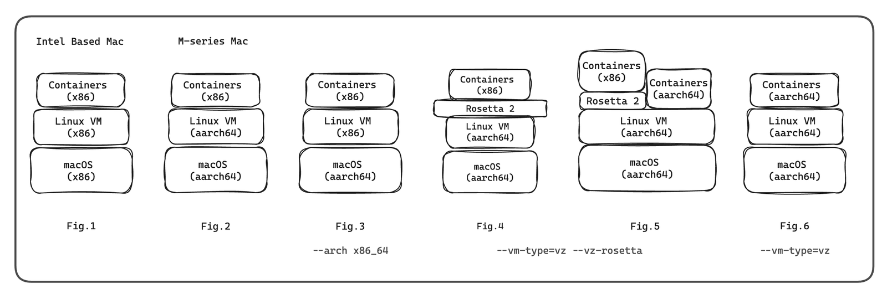

The story started for me with the mail  to explore alternatives to docker desktop and try colima. 
I never heard of colima before. During the setup process, I became interested in how it works under the hood. And I started with the question “What is colima?”.

So Colima is **Co**ntainers on **Li**nux on **Ma**c. First thought came into mind was why colima and why not **coma** (funny name, isn’t it 😁) i.e. Containers on Mac. Why can’t we run containers directly on macOS?

The reason is, macOS is built on the **XNU kernel**, which has a different architecture compared to the Linux kernel. Kernel should have some features to support **containerization**, out of which two main features are: **namespaces** and **cgroups.** These features provide the foundation for container isolation and resource management, making it possible to run multiple containers on a single system and macOS doesn't provide these in the way that Linux does.

So that was clear, now we know why to run linux on mac but the next question is how to run  **li**nux on **ma**c. Yes, **lima :)**  So colima uses lima internally to run linux VM on mac.  Not just colima, but some well-known applications like **Rancher Desktop,** **Finch, Podman Desktop** also use lima.  
 
Lima is an open source project that launches linux VMs. The motivation to create lima was to promote the use of containerd (we will see what that is in some time).

But wait what exactly is virtualization, and what does it mean to run a VM? Well, Virtualization is basically like renting an apartment (VM) in a building (Host), with isolated resources from total available resources. Our Virtual Machine (VM) receives its own isolated CPU, memory, storage, and network, allowing it to run a different operating system than the host OS.

Let’s extend the example of building with the help of the picture above. In the real world, we encounter various types of buildings, just like that, we can have different types of Host Computers.

Our objective is to run a Linux VM on a Mac, so let’s limit our discussion to Mac for now. Today, Macs come in two distinct types: **Intel-based** and **Apple Silicon** (M-series), right?  
  
Well, here it gets more interesting.  Let's deep dive into this.

So, what is essentially different in both Macs is CPU architecture, i.e. **x86 vs ARM**. By the way, do you know the original full form of ARM? It’s **A**corn **R**ISC **M**achine. It’s an awesome story but not now. (Link at the end)

If we go further in-depth, to find exactly what differs in x86 and arm, it’s the instruction set architecture (ISA). So x86 is Complex Instruction Set Computer (CISC) and ARM is Reduced Instruction Set Computer (RISC). With x86 computers, complex series of operations can be executed with a single cycle. The powerful instructions in a CISC computer mean that it needs more transistors, which eat up space and power.

And finally I had the answer, why my teammates with Intel Mac used to complain about heating issues when they used to run all containers. So to design something energy efficient, programmers came up with RISC, which has an instruction set where each instruction represents only a simple operation using lower power.

Ok now we know a bit about CPU architecture, lets see how lima handles it. 

Lima creates a VM with host architecture by default but you can pass  --arch flag to run VM with different architecture. This got me thinking – when would I need to run a VM with a different architecture? Obviously, when I want to run containers of that specific architecture.

And that's when everything started to make sense regarding the issues we faced in account during our local setup.

					  Caution: Migration in progress ⚠️

Story Time !!  I had just been assigned to a new project. And recently, in team some folks had their Intel laptops replaced with new M1 machines. (Yeah, I was also with M1)

Fig.1 → Fig. 2 phase

Yes, it was a migration time. Machine setup doc was divided into two. Colima issues started flooding in the chats. It started becoming a little chaotic. And the reason was, as we can see in the picture (Fig. 2), containers' and VM's architecture was different. Meanwhile, people with intel machines were at peace, everything was the same for them. So people were experimenting with M1 machines to work it out somehow. And someone found about --arch flag.

Fig. 2 → Fig. 3 (colima start --aarch x86_64)

At first, everything seemed to be working for a while. However, people began experiencing slowness and encountered a strange issue, that is, containers were being killed due to OOM (I’m not sure of the exact reason till today but as a quick fix we tried with more memory with the help of --memory flag). After some findings, I was able to interpret the reason behind slowness.

Lima supports two ways of running guest machines: qemu and vz. By default, it is set to qemu which we were using (Fig. 3). Running a VM using vmType = qemu is slow as compared to vz. 

Now, you might wonder, what is this qemu and vz?

Short answer is, **QEMU** is an open source tool and can provide virtualization for various architectures. It can make use of KVM particular features, with which it is able to offer virtualization for x86. On the other hand, **VZ** provides the power of the native virtualization support (hence faster) provided by macOS Virtualization.Framework.

Fig. 3 → Fig. 4 (colima start --vm-type=vz --vz-rosetta)

The team discovered these options and noticed improvements in speed. Everyone was happy, but not for long. But before that, you have a question it seems. Yes, the --vz-rosetta. Aren’t we gonna talk about it? Well, I want you to take a quick look at Fig. 2 and Fig. 4. As we know everything was crashing due to arch mismatch in Fig.2. Then in Fig.4 we added something magical “Rosetta 2” and it started working.

**Rosetta** is a translation process that allows users to run apps that contain x86_64 instructions on Apple silicon. Rosetta allows the capability for Intel Linux apps to run seamlessly in ARM Linux VMs. Rosetta 2 was announced at WWDC20. (why 2 right, where is Rosetta 1? Well, this is not the first time Apple is migrating CPU architecture)

Back to our story, as I told everything seemed to be working at this phase but again containers getting killed by OOM started. (Again, I'm not sure why)

Fig. 4 → Fig. 5

Team was still experimenting with the setup. And finally this phase came, where the image architecture got changed to ARM.  Now the performance and stability both are there 🎉

Currently, we have both some x86 and more arm images. Yes, we are still in Fig. 5 and in future can become Fig. 6.

**Sigh of relief** 

So now we explored lima, but we did not discuss details about how we run containers on lima. This can be a separate story itself. So I will not go in depth (though I would have loved to 🙂) and give just a brief overview. 

As mentioned earlier, lima was developed to promote containerd. The journey from virtualization to the first containers, LXC, runc (OCI), and to containerd is quite fascinating if you're interested in diving deeper into it. Naturally, the next question is what is containerd? →  It's an open-source project that manages the entire container lifecycle (creation, starting, stopping, pausing, etc.).

Inside the VM that lima creates, it also configures and installs containerd as the container runtime engine. This essentially establishes containerd as the core technology that will manage the execution of Docker containers within the virtualized environment.

Finally, what colima adds additionally, it further simplifies the process. It interacts with Lima to manage the VM and configures the Docker socket within the VM. The Docker socket is a special endpoint that acts as a communication channel between Docker CLI and the Docker daemon (dockerd). This allows your Docker commands on the host machine to communicate with the containerd runtime inside the VM.

So in a nutshell, whatever docker command that we execute in our terminal goes to docker daemon (dockerd) with the help of Socket configured, then dockerd make gRPC calls to containerd which is running in linux VM, containerd creates container and start running the application in a nice virtualized environment with all required binaries present there and isolated from rest of the system. That's it for today !!

Thank you so much for reading. I hope this article is helpful and not too confusing. My Intention for writing this blog was to provide a basic overview, which helped me solve or understand issues. In this blog, I have just scratched a surface, where each highlighted word can be explored deep further.  
 

  
**References:**

[Lima: Linux Machines](https://lima-vm.io/docs/)

[containerd/docs/getting-started.md at main](https://github.com/containerd/containerd/blob/main/docs/getting-started.md) 

[https://github.com/abiosoft/colima](https://github.com/abiosoft/colima) 

[Colima | Technology Radar | Thoughtworks India](https://www.thoughtworks.com/en-in/radar/platforms/colima) 

[Rosetta](https://developer.apple.com/documentation/virtualization/running_intel_binaries_in_linux_vms_with_rosetta?changes=_9)

[Story of ARM](https://youtu.be/nIwdhPOVOUk)  
 